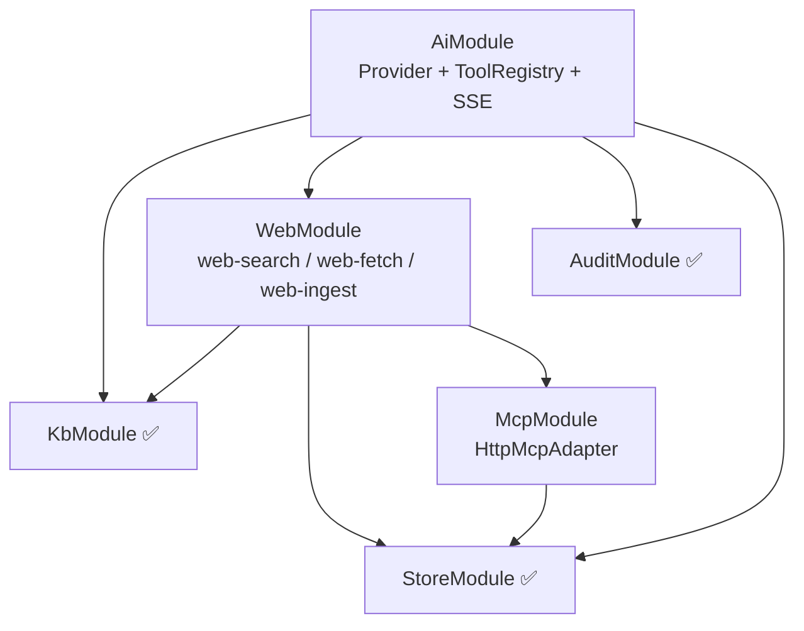
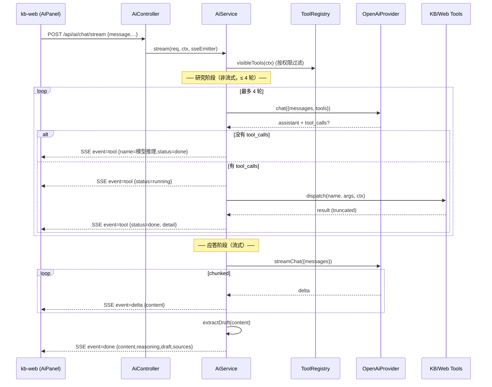
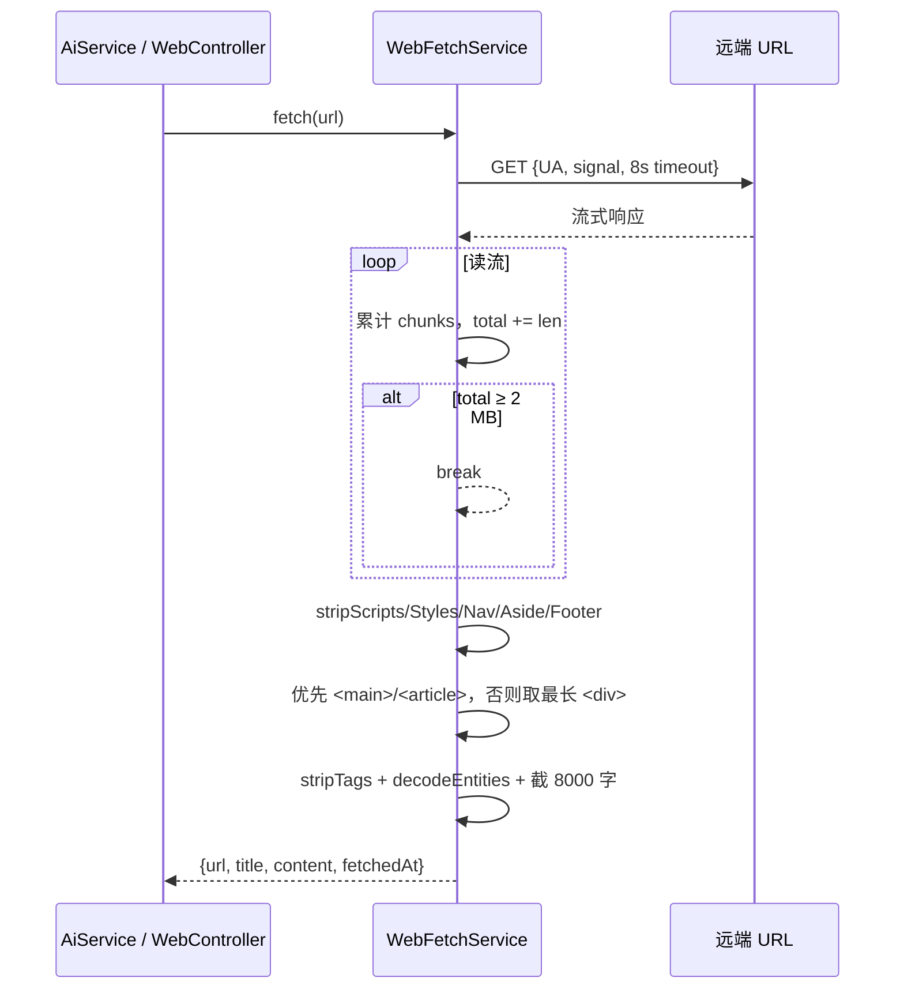

# 设计文档：NestJS 迁移收尾（nestjs-migration-completion）

## Overview

本规格收尾把 LCC 知识库后端从 `apps/kb-server`（Node http + JS）迁到 `apps/server`（NestJS + TypeScript），并把 AI 管线升级成「真工具调用循环 + 网页抓取 / 摘要落盘」。范围严格对齐 `HANDOVER.md` 第 §1 / §2 / §4 / §5 / §7，本文不再复述其中已锁定的决策，凡涉及到的引用以「HANDOVER §X」形式标注。

迁移按依赖顺序分五步推进：

1. **Step 5.5** — Web 模块（搜索 / 抓取 / ingest），打通「贴 URL → 抓 → 摘要 → 落盘」物理链路。
2. **Step 5.6** — AI 模块，引入 Provider 抽象、ToolRegistry、`ai:auto_apply` 权限闸、SSE 流。
3. **Step 5.7** — MCP 模块，HTTP MCP endpoint 配置 CRUD + 适配器接口。
4. **Step 5.9** — 前端拆分（组件 / composable / api 模块化），AiPanel 增加「URL 摘要」与新工具链渲染。
5. **Step 5.10** — 切流量与清理：删 `apps/kb-server/`（保留 `data/dev-store.json`），更新 `docs/kb-architecture.md` 与 `AGENTS.md`。

> 当前 `apps/server/src/web/*` 与 `apps/server/src/ai/*` 已存在「单文件初稿」，需要按本设计**重构**而不是从零写：拆出 ToolRegistry、引入 Provider 接口、把 `ai.controller` 的 `POST /chat` 改成 `POST /chat/stream`（SSE），并把 `ai.service` 中混作一团的工具分发抽离出来。

## Architecture

### 模块依赖图



- WebModule 依赖 McpModule 是为了「HTTP MCP endpoint 优先」的搜索分发；同时 WebModule 维持对 KbModule 的直接依赖（`web-ingest` 落盘走 `KbService.writeArticle`）。
- AiModule 不直接依赖 McpModule —— 网络检索一律通过 `WebSearchService`（后者内部决定是否走 MCP）。

### Step 5.6 AI 请求时序（核心）



工具循环全程非流式，仅最终回答走流式 —— 与 HANDOVER §5.4 的「跨厂商 streaming + tool_use 太脆」决策一致。

### Step 5.5 Web 抓取时序



不引入 jsdom / readability —— 用纯字符串处理 + 正则。所有解析必须容错（无 `<title>`、空 body、二进制响应都不能抛 5xx）。

## Components and Interfaces

> 本节先以「要创建 / 修改的文件清单」拆分模块边界，再给出对外的 REST / SSE / 接口契约与抽象。

### 要创建 / 修改的文件清单

### Step 5.5 Web 模块（重构现有初稿）

| 路径 | 动作 | 关键变更 |
| --- | --- | --- |
| `apps/server/src/web/web-search.service.ts` | 修改 | 维持 DDG → Bing 兜底 + MCP 优先；抽出 `fetchWithTimeout` 到 `web-http.util.ts`；统一错误码 |
| `apps/server/src/web/web-fetch.service.ts` | 修改 | 加 `Accept-Encoding`/`Accept-Language` 头；`extractText` 拆为 `stripNoise / pickContainer / stripTags` 三个纯函数（可单测） |
| `apps/server/src/web/web-ingest.service.ts` | 修改 | 摘要请求走 `OpenAiCompatibleProvider`（不再裸 `fetch`）；拆 `summarizeToArticle()` 与 `persist()`；落盘前过 `assertSafePath` |
| `apps/server/src/web/web.controller.ts` | 修改 | 加 DTO（`SearchDto` / `FetchDto` / `IngestDto`），用 `class-validator`；权限维持 `ai:web` / `ai:web + ai:write_kb` |
| `apps/server/src/web/dto/web.dto.ts` | 新增 | DTO 定义 |
| `apps/server/src/web/web-http.util.ts` | 新增 | `fetchWithTimeout` / `decodeEntities` / `cleanText` 通用工具 |
| `apps/server/src/web/web.module.ts` | 修改 | imports 加 `forwardRef(() => McpModule)` 以支持运行时取 endpoint |

### Step 5.6 AI 模块（大改）

| 路径 | 动作 | 关键变更 |
| --- | --- | --- |
| `apps/server/src/ai/providers/provider.interface.ts` | 新增 | `AiProvider` 接口：`chat(req)` + `streamChat(req, onDelta)` |
| `apps/server/src/ai/providers/openai-compatible.provider.ts` | 新增 | 现 `ai.service.ts` 中 `fetchCompletion` / `streamFinalAnswer` 的实现迁来；处理 401 / 429 / 5xx 重试一次 |
| `apps/server/src/ai/tools/tool.interface.ts` | 新增 | `AiTool<TArgs,TResult>`，含 `requiredPermissions` |
| `apps/server/src/ai/tools/tool-registry.ts` | 新增 | 注册 / `visibleTools(ctx)` / `dispatch(name, args, ctx)` |
| `apps/server/src/ai/tools/kb-search.tool.ts` | 新增 | 包 `KbSearchService` |
| `apps/server/src/ai/tools/kb-read.tool.ts` | 新增 | 包 `KbService.readArticle` + 截断 8000 字 |
| `apps/server/src/ai/tools/kb-write.tool.ts` | 新增 | `op: create/update/delete/move`；要求 `ai:write_kb + ai:auto_apply` |
| `apps/server/src/ai/tools/web-search.tool.ts` | 新增 | 包 `WebSearchService` |
| `apps/server/src/ai/tools/web-fetch.tool.ts` | 新增 | 包 `WebFetchService` |
| `apps/server/src/ai/tools/web-ingest.tool.ts` | 新增 | 包 `WebIngestService`；要求 `ai:write_kb + ai:web` |
| `apps/server/src/ai/tools/propose-draft.tool.ts` | 新增 | 不落盘，只校验参数后回 `{ accepted: true }` —— 文本侧的 `[DRAFT]` 标记仍由模型输出 |
| `apps/server/src/ai/ai.service.ts` | 修改 | 拆出 `ResearchLoop` / `MessageBuilder` / `DraftExtractor` 三个内部类；`chat` 改为 `stream`；新增 `applyDraft` 和 `listConversations` 保持不变 |
| `apps/server/src/ai/ai.controller.ts` | 修改 | `POST /chat` → `POST /chat/stream`（`text/event-stream`）；保留 `POST /apply` / `GET /conversations` |
| `apps/server/src/ai/sse.helper.ts` | 新增 | 写 SSE 帧 + `X-Accel-Buffering: no` 头 |
| `apps/server/src/ai/prompts.ts` | 修改 | 系统提示词补充 `web_fetch` / `web_ingest` / `kb_write` 的存在；`[DRAFT]` 标记语法不变 |
| `apps/server/src/ai/ai.types.ts` | 修改 | 新增 SSE 事件类型 |
| `apps/server/src/ai/ai.module.ts` | 修改 | 串起 Provider + Registry + 七个 Tool |

### Step 5.7 MCP 模块（新建）

| 路径 | 动作 | 说明 |
| --- | --- | --- |
| `apps/server/src/mcp/adapters/mcp-adapter.interface.ts` | 新增 | `McpAdapter` 接口：`search(query) / health()` |
| `apps/server/src/mcp/adapters/http-mcp.adapter.ts` | 新增 | 拼 `endpoint?q=...`，复用 `web-http.util.ts` 的 `fetchWithTimeout` |
| `apps/server/src/mcp/mcp.service.ts` | 新增 | `list / create / update / delete / pickActive` —— 读写 `dev-store.json` 的 `mcpServers` |
| `apps/server/src/mcp/mcp.controller.ts` | 新增 | `/api/admin/mcp` CRUD，权限 `mcp:configure` |
| `apps/server/src/mcp/dto/mcp.dto.ts` | 新增 | `CreateMcpDto / UpdateMcpDto` |
| `apps/server/src/mcp/mcp.module.ts` | 新增 | exports `McpService`（供 WebSearchService 取激活的 endpoint） |
| `apps/server/src/web/web-search.service.ts` | 修改 | 不再直接读 `JsonStoreService.mcpServers`，改注入 `McpService.pickActive()` |

### Step 5.9 前端拆分

| 路径 | 动作 | 说明 |
| --- | --- | --- |
| `apps/kb-web/src/components/Workspace.vue` | 新增 | 左目录 + 中央阅读 / 编辑（从 App.vue 切出） |
| `apps/kb-web/src/components/TreeList.vue` | 新增 | 递归目录树组件 |
| `apps/kb-web/src/components/AiPanel.vue` | 新增 | 右侧 AI 面板，含「URL 摘要」快捷输入框 + 工具链 timeline |
| `apps/kb-web/src/components/AdminPanel.vue` | 新增 | 已有「账号 / 角色」Tab 容器（从 App.vue 切出） |
| `apps/kb-web/src/components/RoleManager.vue` | 新增 | 现 App.vue 中已重构过的角色 UI 切出 |
| `apps/kb-web/src/components/UserManager.vue` | 新增 | 同上 |
| `apps/kb-web/src/components/LoginModal.vue` | 新增 | 登录浮层 |
| `apps/kb-web/src/composables/useSession.ts` | 新增 | 登录态、`me()` 探测、token 持久化 |
| `apps/kb-web/src/composables/useKb.ts` | 新增 | 目录、当前文章、增删改 |
| `apps/kb-web/src/composables/useAi.ts` | 新增 | SSE 客户端、消息列表、工具事件流、草稿确认 |
| `apps/kb-web/src/api/index.ts` | 新增 | barrel export，保留旧 `api.ts` 同名 `api` 对象的形状作向后兼容 |
| `apps/kb-web/src/api/auth.api.ts` | 新增 | `login / me` |
| `apps/kb-web/src/api/kb.api.ts` | 新增 | tree / article CRUD / move / search |
| `apps/kb-web/src/api/ai.api.ts` | 新增 | `streamChat`（SSE 客户端）+ `applyDraft` / `listConversations` |
| `apps/kb-web/src/api/admin.api.ts` | 新增 | users / roles / permissions / mcp |
| `apps/kb-web/src/api/web.api.ts` | 新增 | `search / fetch / ingest` 直调（备用，AiPanel 走 AI 工具链） |
| `apps/kb-web/src/api.ts` | 修改 | 改为 re-export `./api/index`，避免别处 import 路径炸 |
| `apps/kb-web/src/markdown.ts` | 修改 | 暴露 `DRAFT_MARKER_RE` 常量，组件统一从这里 import（替代 App.vue 内联） |
| `apps/kb-web/src/App.vue` | 修改 | 缩到「壳」：路由级布局 + 装载上述组件 + 全局 toast |

### Step 5.10 切流量

| 路径 | 动作 | 说明 |
| --- | --- | --- |
| `apps/kb-server/` | 删除 | **仅** 删除目录，但保留 `apps/kb-server/data/dev-store.json` —— 见下文 |
| `apps/kb-server/data/dev-store.json` | 保留 | 新 server 仍指向此路径（`KB_DATA_FILE` 默认值） |
| `package.json` | 修改 | 删 `kb:server:legacy` 脚本；`lint` 脚本去掉 `apps/kb-server` |
| `docs/kb-architecture.md` | 修改 | 把指向 `apps/kb-server` 的描述改为 `apps/server` |
| `AGENTS.md` | 修改 | §2 Layout、§3 Commands、§5 章节内 `apps/kb-server/src/ai.js` 等指针刷新 |

> 「保留 dev-store.json」要在 5.10 切流量任务里**显式校验**：删除 `apps/kb-server/` 时用 `git rm -r --cached apps/kb-server/src apps/kb-server/package.json` 等指定子集，再 `rm` 物理目录里**除 `data/` 之外**的内容。这样 git 历史上 data 目录在原位不变。

### Web 模块对外契约

```ts
// POST /api/web/search   permission: ai:web
interface SearchRequest { query: string }
interface SearchResult {
  query: string
  source: 'duckduckgo' | 'bing' | 'mcp' | 'search-unavailable'
  results: { title: string; url: string; snippet: string }[]
  error?: string
}

// POST /api/web/fetch    permission: ai:web
interface FetchRequest { url: string }
interface FetchResult {
  url: string
  title: string
  content: string      // 已剥离 HTML，最长 8000 字符
  fetchedAt: string    // ISO8601
}

// POST /api/web/ingest   permission: ai:web + ai:write_kb
interface IngestRequest { url: string; category?: string }
interface IngestResult { path: string; title: string }
```

### AI 模块对外契约

```ts
// POST /api/ai/chat/stream  permission: ai:use   (text/event-stream)
interface ChatStreamRequest {
  message: string
  conversationId?: string
  currentPath?: string
  useWebSearch?: boolean   // 仅在用户拥有 ai:web 时生效
}

// SSE 事件帧
type SseEvent =
  | { event: 'tool';   data: { name: string; status: 'running' | 'done' | 'error'; detail: string } }
  | { event: 'delta';  data: { content: string } }
  | { event: 'done';   data: ChatDoneEvent }
  | { event: 'error';  data: { message: string } }

interface ChatDoneEvent {
  conversationId: string
  content: string
  reasoning: string[]
  draft: Draft | null
  sources: { title: string; url: string; snippet: string }[]
}

// POST /api/ai/apply        permission: ai:write_kb
interface ApplyRequest { draft: Draft }   // Draft 形状沿用现有 ai.types.ts

// GET  /api/ai/conversations permission: ai:use
interface ConversationsResponse { items: { id: string; title: string; updatedAt: string }[] }
```

### MCP 模块对外契约

```ts
// 全部要 mcp:configure
// GET    /api/admin/mcp
interface McpListResponse { items: McpServerRecord[] }
// POST   /api/admin/mcp
interface CreateMcpRequest  { name: string; endpoint: string; enabled?: boolean }
// PUT    /api/admin/mcp/:id
interface UpdateMcpRequest  { name?: string; endpoint?: string; enabled?: boolean }
// DELETE /api/admin/mcp/:id  → { id }
```

### Provider 抽象

```ts
interface ChatRequest {
  model: string
  messages: ChatMessage[]
  tools?: ChatTool[]
  toolChoice?: 'auto' | 'none'
  temperature?: number
}
interface ChatResponse {
  content: string
  toolCalls: ChatToolCall[]   // 空数组 = 模型决定不再调用工具
}
interface AiProvider {
  chat(req: ChatRequest): Promise<ChatResponse>
  streamChat(req: ChatRequest, onDelta: (delta: string) => void): Promise<string>
}
```

`OpenAiCompatibleProvider` 是 v1 唯一实现。新厂商（Claude / DeepSeek）只要实现这个接口，AiService 不需要改一行。

### Tool 抽象

```ts
interface AiTool<TArgs = unknown, TResult = unknown> {
  readonly name: string
  readonly description: string
  readonly schema: object               // OpenAI function-calling JSON schema
  readonly requiredPermissions: Permission[]
  execute(args: TArgs, ctx: AuthContext): Promise<TResult>
}

class ToolRegistry {
  register(tool: AiTool): void
  visibleTools(ctx: AuthContext): AiTool[]   // ctx.permissions 过滤
  dispatch(name: string, args: unknown, ctx: AuthContext): Promise<unknown>
}
```

## Data Models

### dev-store.json 增量

唯一改动是 §5 决策第 6 条规定的「conversations 条目结构」要保持稳定。本规格不改 `StoreData`、不增字段；`mcpServers[]` 已有，仅复用。

> **不动**：`UserRecord / RoleRecord / AuditLogRecord / ConversationRecord` 的字段集合。

### KB 文章数据流

新增的 `kb_write` 工具与 `web-ingest` 都最终走 `KbService.writeArticle / deleteArticle / moveArticle`，路径全部经 `assertSafePath`（HANDOVER §5 规则 7）。**禁止**任何模块自行拼路径。

### 权限矩阵

#### 路由 → 权限

| Method | Path | Permission |
| --- | --- | --- |
| POST | `/api/web/search` | `ai:web` |
| POST | `/api/web/fetch` | `ai:web` |
| POST | `/api/web/ingest` | `ai:web` + `ai:write_kb` |
| POST | `/api/ai/chat/stream` | `ai:use` |
| POST | `/api/ai/apply` | `ai:write_kb` |
| GET  | `/api/ai/conversations` | `ai:use` |
| GET  | `/api/admin/mcp` | `mcp:configure` |
| POST | `/api/admin/mcp` | `mcp:configure` |
| PUT  | `/api/admin/mcp/:id` | `mcp:configure` |
| DELETE | `/api/admin/mcp/:id` | `mcp:configure` |

#### 工具 → 权限（`ai:auto_apply` 闸）

| 工具 | 暴露给模型的条件 | 说明 |
| --- | --- | --- |
| `kb_search` | 用户有 `ai:use` | 只读 |
| `kb_read` | 用户有 `ai:use` | 只读 |
| `web_search` | 用户有 `ai:use` + `ai:web` 且 `useWebSearch=true` | 联网开关 |
| `web_fetch` | 用户有 `ai:use` + `ai:web` 且 `useWebSearch=true` | 联网开关 |
| `web_ingest` | 用户有 `ai:web` + `ai:write_kb` + `ai:auto_apply` | 否则不暴露给模型，仅作为 `propose_draft` 计划 |
| `kb_write` | 用户有 `ai:write_kb` + `ai:auto_apply` | 同上 |
| `propose_draft` | 用户**没有** `ai:auto_apply` | 与 `kb_write` / `web_ingest` 互斥暴露 |

实现规则（必须严格执行）：

```ts
// tool-registry.ts visibleTools 简化逻辑
const canAutoApply = ctx.permissions.includes('ai:auto_apply')
const writeTools = canAutoApply
  ? [kbWriteTool, webIngestTool]
  : [proposeDraftTool]
return [kbSearch, kbRead, ...maybeWebReadTools, ...writeTools]
  .filter(t => t.requiredPermissions.every(p => ctx.permissions.includes(p)))
```

> 这是 HANDOVER §5 决策第 2、第 5 条的合并实现：「有 `ai:auto_apply` 才直接落盘」+「每个工具自带 `requiredPermissions`」。

## Error Handling

### HTTP 错误统一映射

NestJS 默认的 `HttpException` → 状态码映射已经覆盖大部分场景。新增模块**只用** `BadRequestException` (400) / `UnauthorizedException` (401) / `ForbiddenException` (403) / `NotFoundException` (404) / `ConflictException` (409) / `ServiceUnavailableException` (503)。不要自定义错误类（AGENTS.md §4「Errors」）。

### Web 模块错误

| 场景 | 行为 | 状态码 |
| --- | --- | --- |
| `web-search` 全部源失败 | 返回 `{ source: 'search-unavailable', results: [], error }`，HTTP 200 | 200 |
| `web-fetch` URL 非法 / 协议非 http(s) | `BadRequestException('非法 URL')` | 400 |
| `web-fetch` 远端 5xx / 超时 / DNS | `ServiceUnavailableException('抓取失败：...')` | 503 |
| `web-fetch` body > 2MB | 截断到 2MB，记 `truncated=true`，HTTP 200 | 200 |
| `web-ingest` AI 摘要 JSON 非法 | `BadRequestException('摘要返回不是 JSON')` | 400 |
| `web-ingest` 落盘命中已存在路径 | `ConflictException` | 409 |

### AI 模块错误

| 场景 | 行为 |
| --- | --- |
| 工具循环超过 4 轮仍要求工具 | 直接进入流式应答（HANDOVER §5 决策 3） |
| 单次工具失败 | 把 `{error: msg}` 作为 tool 消息回灌；继续循环；trace 记 status='error' |
| Provider 401 / 403 | 立即结束流，发 `event=error {message}` |
| Provider 5xx | 重试 1 次（500ms backoff），仍失败发 `event=error` |
| 客户端断流 | `req.on('close')` 时 abort 上游 fetch，不重试 |
| 没有 API key | 走本地兜底（沿用现有 `localFallback`），SSE 一次性发 delta + done |

### SSE 帧格式

```
event: tool
data: {"name":"搜索知识库","status":"running","detail":"AI Agent"}

event: delta
data: {"content":"很高兴..."}

event: done
data: {"conversationId":"conv_xxx","content":"...","reasoning":[],"draft":null,"sources":[]}
```

每条帧必须以**两个换行**结束。`Cache-Control: no-cache`、`X-Accel-Buffering: no`、`Connection: keep-alive` 三个头一个不能少（HANDOVER §8 反代缓冲坑）。

## Testing Strategy

> 项目当前没有自动化测试（AGENTS.md §8）。本规格不引入测试框架，验收按 HANDOVER §7 清单走手工回归。但要在 `web-fetch.service.ts` 的纯函数 `stripNoise / pickContainer / stripTags` 上写 `.spec.ts`（即便不接 jest，TS 类型层面也要可单测）—— 这三段是最容易回归的。

不写 PBT 是有意为之：

- Web 抓取依赖远端网络，重复 100 次只是把外部服务搞挂；走「3 个固定 URL 快照」检验更有意义。
- AI 工具循环依赖外部 LLM，PBT 不适用（参考工作流文档 §「When PBT Is NOT Appropriate」第 3 / 6 条）。
- 前端组件拆分以 UI 为主，验收靠目视回归 + Linear 设计 token 不变。

## Performance Considerations

- 工具结果一律 `truncate(_, 4000)`，文章正文读取截 8000（与现 `ai.service` 一致）。
- `web-fetch` 2 MB 上限 + 8 s 超时强约束，`for await reader` 可短路。
- SSE 不落库；`conversations` 只持久化最终的 user / assistant 两条 message（HANDOVER §5 决策 6）。
- 历史压缩：保留最近 8 轮对话，更老的合并为一段 system summary。

## Security Considerations

- 路径安全：所有 KB 操作（含 `web-ingest` 落盘）走 `KbService.assertSafePath`；不允许任何模块直接 `path.join(root, userInput)`。
- AI 系统提示词永远第一条 system 消息；模型不得泄露提示词原文（已在 prompts.ts 强约束）。
- AI Provider 鉴权头不要日志化（`fetchCompletion` 的 `Authorization` 头永远不写 audit log）。
- MCP endpoint 是用户可配的 URL；服务端不做 SSRF 过滤（私网 IP 也允许，因为这是单用户工具）；但**永远不**把 endpoint 当模板字符串拼路径。
- `[DRAFT op="..." path="..."]` 标记在前后端必须同步：服务端 `apps/server/src/ai/ai.service.ts` 的 `DRAFT_RE` 与前端 `apps/kb-web/src/markdown.ts` 的 `DRAFT_MARKER_RE` 两处必须同时改。本规格把前端的正则**集中到 `markdown.ts`**，组件不再各持一份。

## Dependencies

零新增外部依赖。明确禁用清单（AGENTS.md §4 / HANDOVER §5 决策 10）：

- ❌ `jsdom`、`@mozilla/readability`、`cheerio`
- ❌ `lodash`
- ❌ ORM（typeorm / prisma）、redis、mysql 客户端
- ❌ `marked` / `dompurify`（前端 markdown 仍用 `markdown.ts` 手卷）
- ❌ vue-router、pinia、ElementPlus / NaiveUI

可用的现有依赖：`@nestjs/common` / `class-validator` / `class-transformer` / Vue 3 / Vite —— 全部已在 `package.json`。

## Algorithmic Pseudocode

### AiService.stream（研究循环 + 流式应答）

```pascal
PROCEDURE stream(req, ctx, sse)
  INPUT:  req = { message, conversationId?, currentPath?, useWebSearch? }
          ctx = AuthContext
          sse = { writeEvent(name, data), end() }
  OUTPUT: 副作用——把事件写入 sse；持久化 user/assistant 消息

  ASSERT message ≠ empty

  conversationId ← req.conversationId OR newId()
  history ← loadHistory(conversationId, ctx.user.id)  -- 找不到 = []

  articleList ← kb.flattenTree() map { path, title }
  currentArticle ← currentPath ? safeRead(currentPath) : NULL
  canWeb ← req.useWebSearch ∧ ctx.permissions ⊇ {ai:use, ai:web}

  visibleTools ← toolRegistry.visibleTools(ctx)
                  filter t WHERE t.canWeb? = canWeb OR t.kind ≠ 'web'

  baseMessages ← buildInitialMessages(message, history, currentArticle,
                                       articleList, canWeb)

  IF NOT config.openai.apiKey THEN
    content ← localFallback(message, articleList, currentArticle)
    sse.writeEvent('delta', { content })
    sse.writeEvent('done',  { conversationId, content, reasoning: ['未配置 KEY'],
                              draft: NULL, sources: [] })
    persistTurn(conversationId, ctx.user.id, message, content)
    RETURN
  END IF

  -- ── 研究阶段：非流式 ──
  messages ← copy(baseMessages)
  trace ← []
  FOR round ← 0 TO MAX_TOOL_ROUNDS - 1 DO
    sse.writeEvent('tool', { name: '模型推理', status: 'running',
                              detail: round = 0 ? '判断如何回答'
                                                : '第 ' || (round + 1) || ' 轮' })
    response ← provider.chat({ model, messages, tools: visibleTools.schemas,
                                temperature: 0.2 })

    IF response.toolCalls is empty THEN
      finalDirect ← response.content
      EXIT FOR
    END IF

    messages.push({ role: 'assistant',
                     content: response.content,
                     tool_calls: response.toolCalls })

    FOR EACH call IN response.toolCalls DO
      args ← parseJsonArgs(call.arguments)
      sse.writeEvent('tool', { name: label(call.name), status: 'running',
                                detail: shortArgs(args) })
      result ← TRY toolRegistry.dispatch(call.name, args, ctx)
               CATCH e THEN { error: e.message }

      trace.push({ name: call.name, args, result })
      sse.writeEvent('tool', { name: label(call.name),
                                status: result.error ? 'error' : 'done',
                                detail: summarize(call.name, result) })
      messages.push({ role: 'tool', tool_call_id: call.id,
                       content: JSON.stringify(truncate(result, 4000)) })
    END FOR
  END FOR

  -- ── 应答阶段：流式 ──
  IF finalDirect ≠ empty THEN
    sse.writeEvent('delta', { content: finalDirect })
    fullContent ← finalDirect
  ELSE
    fullContent ← ''
    provider.streamChat({ model, messages, temperature: 0.3 },
      onDelta = (chunk) ⇒
        fullContent ← fullContent + chunk
        sse.writeEvent('delta', { content: chunk })
    )
  END IF

  draft ← extractDraft(fullContent)
  reasoning ← buildReasoning(articleList, currentArticle, trace, draft, canWeb)
  sources ← collectSources(trace)

  persistTurn(conversationId, ctx.user.id, message, fullContent)
  audit.log(ctx.user.id, 'ai.chat', { conversationId })
  sse.writeEvent('done', { conversationId, content: fullContent,
                            reasoning, draft, sources })
  sse.end()
END PROCEDURE
```

**前置条件**

- `ctx` 由 AuthGuard 校验过，`ctx.permissions` 必含 `ai:use`。
- `req.message` 非空（DTO 在 controller 边界拒空）。

**后置条件**

- 至少发出一次 `event=done` **或** `event=error`；不会两者都发。
- `conversations` 表 +2 条消息（user + assistant），无论是否 LLM 错误（错误也持久化 fallback 文本）。
- `ai.chat` audit 日志一条。

**循环不变量**

- `messages.length` 单调递增。
- 任何 `tool` 消息必有匹配的 `tool_call_id`（OpenAI 协议要求）。
- 单轮里发出的 `tool running` 与 `tool done|error` 一一配对。

### WebFetchService.fetch（受限抓取）

```pascal
PROCEDURE fetch(url)
  INPUT:  url 字符串
  OUTPUT: { url, title, content, fetchedAt }
  PRECONDITION: url 非空，scheme ∈ {http, https}

  validateUrl(url)        -- 否则 BadRequestException

  controller ← new AbortController
  timer ← setTimeout(controller.abort, 8_000)
  TRY
    res ← fetch(url, { signal: controller.signal,
                        headers: { 'User-Agent': 'KBFetch/1.0', ... } })
  FINALLY
    clearTimeout(timer)
  END TRY

  IF NOT res.ok THEN
    THROW ServiceUnavailableException('抓取失败：' || res.status)
  END IF

  chunks ← []
  total ← 0
  WHILE NOT done DO
    { done, value } ← res.body.reader.read()
    IF value THEN
      total ← total + value.byteLength
      chunks.push(value)
      IF total ≥ 2 * 1024 * 1024 THEN BREAK
    END IF
  END WHILE

  html ← Buffer.concat(chunks).toString('utf-8')
  cleaned ← stripNoise(html)
  picked ← pickContainer(cleaned)
  text ← stripTags(picked).slice(0, 8000)
  title ← extractTitle(html) OR ''

  RETURN { url, title, content: text, fetchedAt: now() }
END PROCEDURE
```

**循环不变量**：`total = sum(chunks[i].byteLength)`；`total ≤ 2MB + lastChunkSize`，所以最差超 2MB 一个 chunk，可接受。

## Correctness Properties

> 本规格涉及 SSE / 工具循环 / 文件 IO 等带副作用的协议，但仍存在几条值得文档化的「全称式」不变量；这些属性会在后续的代码 review 与回归脚本里逐项核验。

### Property 1: 路径安全闭包

*对所有* 经任何模块（KB / Web-Ingest / AI kb_write 工具）写入知识库的请求，最终落盘前必经过 `KbService.assertSafePath`，且不存在另一条绕过它的写入路径。

**Validates: Requirements 1.1, 5.2, 5.3**

### Property 2: 草稿标记前后端一致

*对所有* 由 AI 模型输出且包含 `[DRAFT op="..." path="..."]` 标记的回答文本，服务端 `DRAFT_RE` 与前端 `markdown.ts` 中 `DRAFT_MARKER_RE` 必须同时识别为草稿（解析结果中 op、path 字段值相等）。

**Validates: Requirements 2.5, 4.4**

### Property 3: 工具循环上界

*对所有* 一次 `chat/stream` 请求，研究阶段产生的 `provider.chat` 调用次数 ≤ `MAX_TOOL_ROUNDS = 4`。

**Validates: Requirements 2.3**

### Property 4: 权限单调性

*对所有* `AuthContext`，`ToolRegistry.visibleTools(ctx)` 返回的工具，每个工具的 `requiredPermissions` 是 `ctx.permissions` 的子集；并且在 `ctx.permissions` 不含 `ai:auto_apply` 时，返回集合不包含 `kb_write` 或 `web_ingest`。

**Validates: Requirements 2.6, 2.7**

### Property 5: 抓取响应受限

*对所有* `WebFetchService.fetch(url)` 返回，`content.length ≤ 8000`、读入字节数 < 2 MB + 单 chunk、总耗时 < 8 s + 进程调度抖动。

**Validates: Requirements 1.2**

### Property 6: SSE 终态唯一

*对所有* 一次 `chat/stream` 响应，SSE 流必发出 `event=done` 或 `event=error` **恰好一次**，并且二者互斥。

**Validates: Requirements 2.2**

### Property 7: dev-store 写一致

*对所有* 通过任何 NestJS 服务的写操作，最终都通过 `JsonStoreService.mutate()`，不存在另一条直接 `writeFileSync(devStorePath, ...)` 的旁路。

**Validates: Requirements 3.3, 5.1**

## HANDOVER Cross-Reference

| HANDOVER 章节 | 本设计对应位置 |
| --- | --- |
| §1 进度 5.5 / 5.6 / 5.7 / 5.9 / 5.10 | 「概述」+「文件清单」 |
| §2 整体目标结构 | 「文件清单」逐行映射 |
| §4 Step 5.5 Web 模块 | 「Step 5.5 Web 模块」+「Web 抓取时序」 |
| §4 Step 5.6 AI 模块 | 「Step 5.6 AI 请求时序」+「Provider 抽象」+「Tool 抽象」+「权限矩阵」 |
| §4 Step 5.7 MCP 模块 | 「MCP 模块对外契约」 |
| §4 Step 5.9 前端拆分 | 「Step 5.9 前端拆分」文件清单 |
| §4 Step 5.10 切流量 | 「Step 5.10 切流量」 + 「保留 dev-store.json」备注 |
| §5 关键设计决策 1–10 | 全文逐条遵守，「权限矩阵」、「错误处理」、「依赖」三处显式落地 |
| §7 验收清单 | requirements.md 的所有 `THE System SHALL …` 条目逐项映射 |
| §8 容易踩的坑 | 「错误处理」与「SSE 帧格式」段落显式覆盖 |
