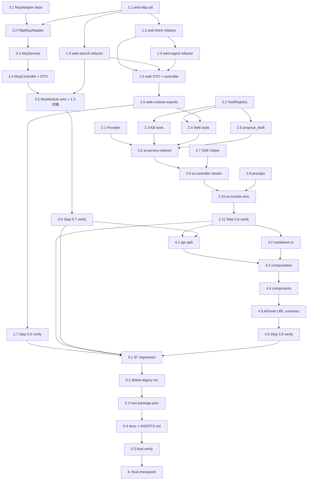

# Implementation Plan: NestJS 迁移收尾（nestjs-migration-completion）

> Convert the feature design into a series of prompts for a code-generation LLM that will implement each step with incremental progress. Make sure that each prompt builds on the previous prompts, and ends with wiring things together. There should be no hanging or orphaned code that isn't integrated into a previous step. Focus ONLY on tasks that involve writing, modifying, or testing code.

## Overview

实施分五步，按 HANDOVER §1 与 §4 的依赖顺序推进：5.5（Web）→ 5.6（AI）→ 5.7（MCP）→ 5.9（前端）→ 5.10（切流量）。每一步末尾固定有一个验证任务（`pnpm type-check` / `pnpm lint` / `pnpm kb:server:build` / `pnpm kb:build`），全绿才能进下一步。

### Dependency / Parallelism Hints

- **Step 5.5（Web）** 与 **Step 5.7（MCP）** 中除 `WebSearchService.pickActive` 衔接点之外**完全独立**：5.7 的 1.0–4.0 子任务可以与 5.5 的 2.x / 3.x 并行执行。在主依赖图上，5.5 仅依赖「5.7 的 `McpService.pickActive` 方法 + Module export」（任务 7.3）就绪。
- **Step 5.6（AI）** 强依赖 Step 5.5 的 `WebSearchService` / `WebFetchService` / `WebIngestService`。
- **Step 5.9（前端）** 强依赖 Step 5.6 的 `POST /api/ai/chat/stream` 与 Step 5.7 的 `/api/admin/mcp` 落地。组件 / composable / api 拆分 内部互相独立（4.1–4.4 可并行）。
- **Step 5.10（切流量）** 必须最后跑；其它 step 全部 verification 通过才能开始。

## Task Dependency Graph



并行批次（同批可并行执行）：

```json
{
  "waves": [
    { "name": "A", "tasks": ["1.1"] },
    { "name": "B", "tasks": ["1.2", "1.3", "3.1"] },
    { "name": "C", "tasks": ["1.4", "3.2", "2.1", "2.2", "2.7", "2.9"] },
    { "name": "D", "tasks": ["1.5", "3.3", "2.3", "2.4", "2.5"] },
    { "name": "E", "tasks": ["1.6", "3.4"] },
    { "name": "F", "tasks": ["1.7", "3.5"] },
    { "name": "G", "tasks": ["3.6", "2.6"] },
    { "name": "H", "tasks": ["2.8"] },
    { "name": "I", "tasks": ["2.10"] },
    { "name": "J", "tasks": ["2.11"] },
    { "name": "K", "tasks": ["4.1", "4.2"] },
    { "name": "L", "tasks": ["4.3"] },
    { "name": "M", "tasks": ["4.4"] },
    { "name": "N", "tasks": ["4.5"] },
    { "name": "O", "tasks": ["4.6"] },
    { "name": "P1", "tasks": ["5.1"] },
    { "name": "P2", "tasks": ["5.2"] },
    { "name": "P3", "tasks": ["5.3"] },
    { "name": "P4", "tasks": ["5.4"] },
    { "name": "P5", "tasks": ["5.5"] },
    { "name": "P6", "tasks": ["6"] }
  ]
}
```

补充说明：

- 批 B 中 `1.3`（web-search refactor）会先用占位 `pickActive`，到批 F 的 `3.5` 才切换到真实 `McpService.pickActive()`。
- 批 D 的 `2.4`（web tools）依赖批 E 的 `1.6`（web.module exports），所以 `2.4` 实际要等到批 E 完成后才执行；为简化波次，把它分到批 D 是因为其它前置（`2.2`、`1.4`）都已就绪——若严格按依赖图，把 `2.4` 移到批 E 也可。Orchestrator 可按依赖关系自动安排。
- 批 P1–P6 必须串行，因为是切流量动作。

## Tasks

- [ ] 1. **Step 5.5 · Web 模块准备**
  - 重构现有 `apps/server/src/web/*` 初稿成可单测、可被 AI 工具复用的形态。
  - _Requirements: 1.1, 1.2, 1.3, 1.4, 1.5, 1.6, 1.7_

- [x] 1.1 抽出 web 通用工具
  - 新建 `apps/server/src/web/web-http.util.ts`，迁入 `fetchWithTimeout`、`cleanText`、`decodeEntities` 三个纯函数；导出供 `web-search` / `web-fetch` 复用。
  - _Requirements: 1.5, 1.7_

- [ ] 1.2 重构 `web-fetch.service.ts`
  - 把 `extractText` 拆为 `stripNoise(html) → string`、`pickContainer(html) → string`、`stripTags(html) → string` 三个纯函数（导出供单测）。
  - 在出站请求头加 `Accept-Language: zh-CN,en;q=0.7`、`Accept-Encoding: gzip, deflate`，保留 `User-Agent`。
  - 校验入参 URL：scheme ∈ {http, https}，否则抛 `BadRequestException('非法 URL')`。
  - 远端 5xx / 超时 / DNS 错误统一抛 `ServiceUnavailableException('抓取失败：...')`。
  - 维持 8 秒超时与 2 MB 字节上限（已实现），重新走 readable stream 分块循环。
  - _Requirements: 1.3, 1.4, 1.5, 1.6, 1.7_
  - _依赖：1.1_

- [~] 1.3 重构 `web-search.service.ts`
  - 删去 `cleanText` / `fetchWithTimeout` 局部实现，改 import `web-http.util.ts`。
  - 不再直接 `JsonStoreService.read().mcpServers`，改注入 `McpService.pickActive()`（`McpService` 由 7.3 提供；本任务可先用 `pickActive(): McpServerRecord | null` 占位接口，5.7 完成后切换）。
  - DDG 与 Bing 两条分支保持兜底顺序。
  - _Requirements: 1.1, 1.2_
  - _依赖：1.1_

- [~] 1.4 重构 `web-ingest.service.ts`
  - 摘要请求改为通过 `OpenAiCompatibleProvider.chat`（在 Step 5.6 落地后接入）；本任务先抽出 `summarizeToArticle(content): Promise<{title,slug,category,markdown}>` 与 `persist(meta) -> Article` 两个内部函数。
  - 落盘前显式过 `KbService.assertSafePath`（注：现 `KbService.writeArticle` 内部已经过；这里要在拼路径阶段也调一次，确保 `${category}/${slug}.md` 整体合法）。
  - 命中已存在路径时抛 `ConflictException`。
  - _Requirements: 1.8, 1.9_
  - _依赖：1.2_

- [~] 1.5 添加 Web 控制器 DTO
  - 新建 `apps/server/src/web/dto/web.dto.ts`：`SearchDto { @IsString @IsNotEmpty query }`、`FetchDto { @IsString @IsNotEmpty url }`、`IngestDto { @IsString @IsNotEmpty url; @IsOptional @IsString category? }`。
  - 改 `web.controller.ts` 用 DTO 接收 body；保留 `@RequirePermissions('ai:web')` / `'ai:web','ai:write_kb'`。
  - _Requirements: 1.1, 1.6, 1.10_
  - _依赖：1.2, 1.3, 1.4_

- [~] 1.6 校验 WebModule 导出契约
  - `web.module.ts`：`exports: [WebSearchService, WebFetchService, WebIngestService]` 保持；imports 加 `forwardRef(() => McpModule)`。
  - 写 README/JSDoc 说明 `WebFetchService` 是「无 jsdom」实现。
  - _Requirements: 1.7_
  - _依赖：1.5_

- [~] 1.7 Step 5.5 验证
  - 跑 `pnpm type-check`、`pnpm lint`、`pnpm kb:server:build`，全绿才进下一步。
  - 跑一次手工：`curl -X POST http://localhost:4010/api/web/fetch -d '{"url":"https://example.com"}'`，确认返回结构正确、`content` 不超 8000 字符。
  - _Requirements: 6.1, 6.2_
  - _依赖：1.1–1.6_

- [ ] 2. **Step 5.6 · AI 模块**
  - Provider 抽象 + ToolRegistry + 七件工具 + SSE 流。
  - _Requirements: 2.x_

- [~] 2.1 写 `AiProvider` 接口与 `OpenAiCompatibleProvider`
  - 新建 `apps/server/src/ai/providers/provider.interface.ts`，按 design 中契约定义 `ChatRequest` / `ChatResponse` / `AiProvider`。
  - 新建 `apps/server/src/ai/providers/openai-compatible.provider.ts`：把现 `ai.service.ts` 的 `fetchCompletion` / `streamFinalAnswer` 全部迁过来；处理 5xx 重试一次（500ms backoff）；处理 401 / 403 直抛。
  - 注册为 `@Injectable()`，依赖 `APP_CONFIG`。
  - _Requirements: 2.17, 2.18_

- [~] 2.2 写 `AiTool` 接口与 `ToolRegistry`
  - 新建 `apps/server/src/ai/tools/tool.interface.ts`：`AiTool<TArgs,TResult>` + `ToolDescriptor`。
  - 新建 `apps/server/src/ai/tools/tool-registry.ts`：`register / visibleTools(ctx) / dispatch(name, args, ctx)`，按 design「权限矩阵 → 工具 → 权限」实现 `ai:auto_apply` 闸。
  - _Requirements: 2.6, 2.7, 2.8, 2.9, 2.10_

- [~] 2.3 实现 KB 三件工具
  - 新建 `kb-search.tool.ts` / `kb-read.tool.ts` / `kb-write.tool.ts`，分别包 `KbSearchService.searchByQuery`、`KbService.readArticle`、`KbService.{writeArticle,deleteArticle,moveArticle}`。
  - `kb_write.execute(args)`：先按 `args.op ∈ {create,update,delete,move}` 分发；任何 path 都先过 `assertSafePath`（由 KbService 内部保证）；返回 `{ op, path, ok: true }`。
  - 在 `tool.schema` 上写 OpenAI function-calling JSON schema。
  - _Requirements: 1.9, 2.6, 2.8, 2.12_
  - _依赖：2.2_

- [~] 2.4 实现 Web 三件工具
  - 新建 `web-search.tool.ts` / `web-fetch.tool.ts` / `web-ingest.tool.ts`，分别包 `WebSearchService.search` / `WebFetchService.fetch` / `WebIngestService.ingest`。
  - `web_search.execute` 与 `web_fetch.execute` 标记 `requiredPermissions = ['ai:use','ai:web']`。
  - `web_ingest.execute` 标记 `requiredPermissions = ['ai:web','ai:write_kb','ai:auto_apply']`。
  - _Requirements: 2.6, 2.8, 2.9, 2.10_
  - _依赖：1.6, 2.2_

- [~] 2.5 实现 `propose_draft` 工具
  - 新建 `propose-draft.tool.ts`：`requiredPermissions = ['ai:use']`；`execute(args)` 仅校验 `args` 是合法的 `Draft` 形状后回 `{ accepted: true, op, path }`。注意：草稿文本仍由模型在 assistant content 里发出 `[DRAFT op="…" path="…"]` 标记，本工具是「我决定要写」的信号，不是真的写盘。
  - _Requirements: 2.7, 2.5_
  - _依赖：2.2_

- [~] 2.6 重构 `ai.service.ts`
  - 拆出 `MessageBuilder`（`buildInitialMessages` + `compactHistory`）、`ResearchLoop`（含 `MAX_TOOL_ROUNDS=4` 上界）、`DraftExtractor`（`DRAFT_RE` 与 `extractDraft`）三个内部 helper。
  - `chat()` 方法名改为 `stream(req, ctx, sse)`；签名按 design「AiService.stream」伪代码实现；持久化 `user + assistant` 两条消息保持不变。
  - 把 Provider / ToolRegistry / 七工具注入；不再有 `fetch('.../chat/completions')` 调用。
  - 保留 `applyDraft` / `listConversations` 方法。
  - _Requirements: 2.2, 2.3, 2.4, 2.5, 2.11, 2.12, 2.13, 2.14, 2.15, 2.17, 2.19, 2.20_
  - _依赖：2.1, 2.2, 2.3, 2.4, 2.5_

- [~] 2.7 写 SSE 帮手
  - 新建 `apps/server/src/ai/sse.helper.ts`：`createSseEmitter(res)` 返回 `{ writeEvent(name, data), end() }`；写响应头 `Cache-Control: no-cache`、`Connection: keep-alive`、`X-Accel-Buffering: no`、`Content-Type: text/event-stream`。
  - _Requirements: 2.1_

- [~] 2.8 改 `ai.controller.ts`
  - 删 `POST /chat`，改 `POST /chat/stream`：注入 `@Res() res`、`@Req() req`，构造 SSE emitter，注册 `req.on('close')` → 触发 `AbortController.abort` 路径。
  - 保留 `POST /apply` 与 `GET /conversations`，权限不变。
  - DTO：新建 `chat-stream.dto.ts` 校验 `message`、`conversationId?`、`currentPath?`、`useWebSearch?`。
  - _Requirements: 2.1, 2.2, 2.16, 2.19_
  - _依赖：2.6, 2.7_

- [~] 2.9 更新 `prompts.ts`
  - 在 SYSTEM_PROMPT 中追加 `web_fetch` / `web_ingest` / `kb_write` / `propose_draft` 工具的简短说明；保持 `[DRAFT op="..."]` 标记语法不变。
  - _Requirements: 2.5_

- [~] 2.10 串 `ai.module.ts`
  - imports：`KbModule, WebModule, AuditModule`；providers：`AiService, OpenAiCompatibleProvider, ToolRegistry`，七个 Tool 全部注册到 Registry 的初始化阶段（在 `onModuleInit` 里 `register()`）。
  - controllers：`AiController`。
  - _Requirements: 2.x_
  - _依赖：2.1–2.9_

- [~] 2.11 Step 5.6 验证
  - `pnpm type-check`、`pnpm lint`、`pnpm kb:server:build` 全绿。
  - 手工：起 server，用 `curl -N -X POST .../api/ai/chat/stream` 跑一次有 `useWebSearch=true` 的请求，确认 SSE `tool` / `delta` / `done` 三类事件按顺序出现。
  - _Requirements: 6.1, 6.2_
  - _依赖：2.10_

- [ ] 3. **Step 5.7 · MCP 模块** _（可与 Step 5.5 并行；但 5.5 的 1.3 任务在切换到真实 `pickActive` 时依赖本步骤）_
  - _Requirements: 3.x_

- [~] 3.1 定义适配器接口
  - 新建 `apps/server/src/mcp/adapters/mcp-adapter.interface.ts`：`McpAdapter { search(query): Promise<SearchResult>; health(): Promise<boolean> }`。
  - _Requirements: 3.6_

- [~] 3.2 实现 `HttpMcpAdapter`
  - 新建 `apps/server/src/mcp/adapters/http-mcp.adapter.ts`：构造时接收 endpoint；`search` 拼 `?q=...` 后用 `web-http.util.ts` 的 `fetchWithTimeout`。
  - _Requirements: 1.2, 3.6_
  - _依赖：1.1, 3.1_

- [~] 3.3 写 `McpService`
  - 新建 `apps/server/src/mcp/mcp.service.ts`：`list / create / update / delete / pickActive`，全部走 `JsonStoreService.mutate()` 或 `read()`；`pickActive(): McpServerRecord | null` 返回第一条 `enabled && type='http'` 的记录。
  - _Requirements: 3.1, 3.2, 3.3, 3.4, 3.6_

- [~] 3.4 写 `McpController` + DTO
  - 新建 `apps/server/src/mcp/mcp.controller.ts`：`/api/admin/mcp` 四个端点全部 `@RequirePermissions('mcp:configure')`。
  - 新建 `dto/mcp.dto.ts`：`CreateMcpDto / UpdateMcpDto`，用 `class-validator`。
  - _Requirements: 3.1, 3.2, 3.3, 3.4, 3.5_
  - _依赖：3.3_

- [~] 3.5 串 `mcp.module.ts`
  - providers / exports `McpService`；imports `StoreModule`；`AppModule` 加 `McpModule`。
  - 然后回到 Step 5.5 的任务 1.3，把 `WebSearchService` 切到注入 `McpService.pickActive()`。
  - _Requirements: 1.2, 3.6_
  - _依赖：3.4_

- [~] 3.6 Step 5.7 验证
  - `pnpm type-check`、`pnpm lint`、`pnpm kb:server:build` 全绿。
  - 手工：登录后端管理页（前端拆分前先用 curl 也行）`curl -X POST .../api/admin/mcp -d '{"name":"local","endpoint":"http://localhost:9000/search","enabled":true}'`，再 GET 一次确认存在。
  - _Requirements: 6.1, 6.2_
  - _依赖：3.5_

- [ ] 4. **Step 5.9 · 前端拆分**
  - 把单文件 `App.vue` 拆出组件、composable、api 模块，并升级 AiPanel。
  - _Requirements: 4.x_

- [~] 4.1 拆 `api.ts` 为 `api/{auth,kb,ai,admin,web}.api.ts`
  - 新建 `apps/kb-web/src/api/index.ts` 作 barrel；新建五个 api 模块文件。
  - 改原 `apps/kb-web/src/api.ts` 为 `export * from './api'` 再加 `export const api = { ... }` 重组对象，保持 import 兼容。
  - 五个 api 文件中：`ai.api.ts` 暴露 `streamChat(req, handlers)`（fetch + ReadableStream + EventSource 解析器）+ `applyDraft / listConversations`；`admin.api.ts` 包 mcp / users / roles / permissions；`web.api.ts` 包 search / fetch / ingest。
  - _Requirements: 4.3, 4.9_

- [~] 4.2 集中 `DRAFT_MARKER_RE` 到 `markdown.ts`
  - 在 `apps/kb-web/src/markdown.ts` 暴露 `export const DRAFT_MARKER_RE = ...`；删 `App.vue` 中重复定义；其它组件 `import { DRAFT_MARKER_RE } from '../markdown'`。
  - _Requirements: 4.4_

- [~] 4.3 拆 composable
  - 新建 `composables/useSession.ts`：`login / logout / me / token` + `permissions` reactive 引用。
  - 新建 `composables/useKb.ts`：tree / current / read / save / delete / move。
  - 新建 `composables/useAi.ts`：维护 `messages` / `toolEvents` / `streamingDraft`，封装 `streamChat` 客户端解析逻辑（按 design SSE 帧格式逐行解析 `event:`、`data:`）。
  - _Requirements: 4.2, 4.9, 4.10_
  - _依赖：4.1, 4.2_

- [~] 4.4 切组件文件
  - 按 design「文件清单 / Step 5.9」一一拆出 `Workspace.vue` / `TreeList.vue` / `AiPanel.vue` / `AdminPanel.vue` / `RoleManager.vue` / `UserManager.vue` / `LoginModal.vue`。
  - `App.vue` 缩为壳（路由级布局 + 装载组件 + 全局 toast）。
  - 严格保持 `styles.css` 与 Linear token；不引入新组件库 / emoji 图标。
  - _Requirements: 4.1, 4.8_
  - _依赖：4.3_

- [~] 4.5 升级 `AiPanel.vue`
  - 顶部加「从 URL 摘要」单行输入框：提交后 `useAi().send('请抓取并总结这个网址，整理成一篇文章：' + url, { useWebSearch: true })`。
  - 工具链 timeline：根据 `event.name` 渲染 7 种工具的图标与详情（`kb_search` / `kb_read` / `web_search` / `web_fetch` / `web_ingest` / `kb_write` / `propose_draft`）。
  - 当 `useSession().permissions.value.includes('ai:auto_apply')` 时，不渲染「确认草稿」按钮，仅渲染「已落盘」操作日志。
  - _Requirements: 4.5, 4.6, 4.7_
  - _依赖：4.4_

- [~] 4.6 Step 5.9 验证
  - `pnpm type-check`、`pnpm lint`、`pnpm kb:build` 全绿。
  - 手工：登录 superadmin → 浏览目录、读文章、AI 面板用 URL 摘要丢一个网址、确认 timeline 显示 `web_fetch → web_ingest → kb_write` 三步、文章正确出现在目录里。
  - 手工：用一个没有 `ai:auto_apply` 的账号验证草稿确认按钮还在。
  - _Requirements: 6.1, 6.2_
  - _依赖：4.5_

- [ ] 5. **Step 5.10 · 切流量与清理**
  - 必须在 Step 5.5–5.9 全部 verification 通过后才开始。
  - _Requirements: 5.x, 6.x_

- [~] 5.1 跑 HANDOVER §7 全量回归
  - 按 HANDOVER §7 「任务完成」清单逐条人工核验：登录 / 目录 / 读 / 编辑 / 删除 / AI chat / AI URL 摘要落盘 / 角色 CRUD / 用户 CRUD / 系统角色不可删 / 不可删自己。
  - 任一条不过都要回到对应 step 修复后再来，不能继续 5.10。
  - _Requirements: 5.1, 6.2_
  - _依赖：1.7, 2.11, 3.6, 4.6_

- [~] 5.2 删 Legacy_Server 源码
  - `git rm -r apps/kb-server/src apps/kb-server/package.json`，**保留** `apps/kb-server/data/dev-store.json` 不动。
  - 验证 `apps/server/src/config/app.config.ts` 中 `KB_DATA_FILE` 默认仍解析到 `apps/kb-server/data/dev-store.json`。
  - _Requirements: 5.2, 5.3_
  - _依赖：5.1_

- [~] 5.3 清根 `package.json`
  - 删 `kb:server:legacy` 脚本。
  - 改 `lint` 脚本：`eslint apps/kb-web apps/server --fix`（去掉 `apps/kb-server`）。
  - _Requirements: 5.4_
  - _依赖：5.2_

- [~] 5.4 更新文档
  - 改 `docs/kb-architecture.md`：所有 `apps/kb-server/src/...` 引用改成 `apps/server/src/...`，描述从「Node http + JS」改为「NestJS + TypeScript」。
  - 改 `AGENTS.md` §2 Layout、§3 Commands、§5 The AI pipeline 段落：把 `apps/kb-server/src/ai.js`、`apps/kb-server/src/mcp.js` 等指针刷新为 `apps/server/src/ai/*`、`apps/server/src/web/*`、`apps/server/src/mcp/*`；§3 表格里 `pnpm kb:server:legacy` 行删除。
  - **不**改 §6 The knowledge base itself / §7 Frontend conventions / §9 Things the agent must not do（与本次迁移无关）。
  - _Requirements: 5.5, 5.6_
  - _依赖：5.3_

- [~] 5.5 Step 5.10 终验
  - 跑 `pnpm type-check`、`pnpm lint`、`pnpm kb:server:build`、`pnpm kb:build`，四件全绿。
  - 重启 `pnpm kb:server` + `pnpm kb:web`，再走一次最小回归：`superadmin / Admin@123456` 登录、读一篇文章、AI 面板 URL 摘要、确认文章生成。
  - 确认 `apps/kb-server/data/dev-store.json` 文件仍然存在且未被改动（`git status` 干净）。
  - 确认 `docs/knowledge/` 下 `.md` 文件计数与 5.10 开始前一致（`find docs/knowledge -name '*.md' | wc -l`）。
  - _Requirements: 5.7, 6.1, 6.2_
  - _依赖：5.4_

- [~] 6. 最终 Checkpoint
  - 跑 `pnpm type-check && pnpm lint && pnpm kb:server:build && pnpm kb:build`，确认全绿；并人工对照 HANDOVER §7 清单逐条勾选。如有疑问，停下问用户。
  - _Requirements: 6.1_
  - _依赖：5.5_

## Notes

- 任何写入知识库的代码路径都必须经过 `KbService.assertSafePath`；新模块严禁直接 `path.join(root, userInput)`。
- 任何 LLM 调用都必须经 `AiProvider`；`AiService` / Tools 不允许出现 `fetch('.../chat/completions')`。
- AuthGuard 注册方式（`APP_GUARD` provider）禁止改动；新模块只用 `@RequirePermissions('xxx')` 与 `@Public()` 装饰器。
- 不允许新增依赖，特别是：jsdom、@mozilla/readability、cheerio、lodash、marked、dompurify、ORM、redis。
- `[DRAFT op="…" path="…"]` 标记前后端必须同步：服务端 `apps/server/src/ai/ai.service.ts` 的 `DRAFT_RE` 与前端 `apps/kb-web/src/markdown.ts` 的 `DRAFT_MARKER_RE` 改一处必改另一处。
- `apps/kb-server/data/dev-store.json` 是 superadmin / Admin@123456 唯一存活点，**任何任务都不能删它**。
- 任务编号末尾**未带 `*`**：本规格选择不引入测试框架（HANDOVER §8 + AGENTS.md §8），所有正确性属性进入 design.md「Correctness Properties」一节作为 code review checklist；不写自动化属性测试 sub-task。
