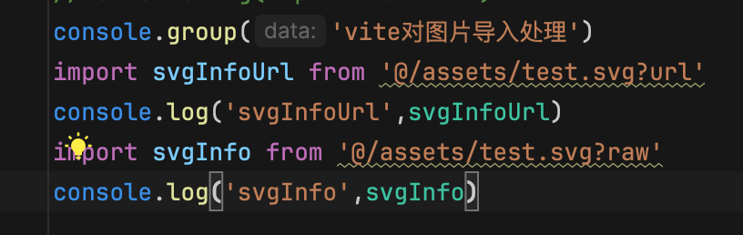
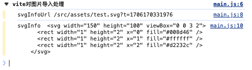
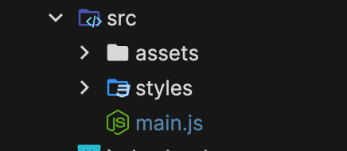
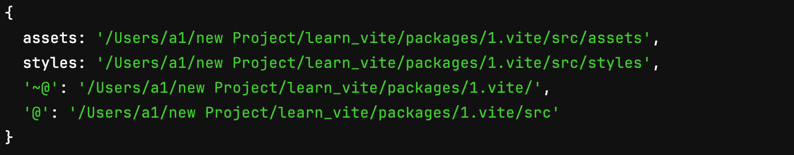

# Vite 学习笔记

这篇笔记整理了使用 Vite 时比较常见的几个配置点，重点包括：

- CSS 模块和预处理器配置
- `resolve.alias` 等路径解析
- `build` 打包输出配置
- 一个自动生成别名的插件示例

## CSS 配置

### CSS Modules

`css.modules` 用来控制 CSS Modules 的导出形式和类名生成规则。

| 属性 | 说明 | 常见值 |
| --- | --- | --- |
| `localsConvention` | 配置导出对象的 key 命名方式 | `camelCase`、`camelCaseOnly`、`dashes`、`dashesOnly`，也可以传自定义函数 |
| `scopeBehaviour` | 是否默认启用模块化 | `local` 表示默认启用，`global` 表示默认关闭 |
| `generateScopedName` | 生成模块类名的规则 | `string` 或 `(name, filename, css) => string` |
| `hashPrefix` | 为 hash 增加前缀 | `string` |
| `globalModulePaths` | 指定不参与模块化的路径 | `string[]` |

关于 `generateScopedName`，常见写法如下：

```js
generateScopedName: "[name]_[local]_[hash:5]";
```

这表示最终类名会由：

- 文件名 `name`
- 原始类名 `local`
- 前 5 位 hash

组成。

### 预处理器

`css.preprocessorOptions` 用来配置 `sass`、`less` 等 CSS 预处理器。

- [Sass 详细配置](https://sass-lang.com/documentation/js-api/interfaces/options/)

### 开发环境 Sourcemap

`css.devSourcemap` 用来控制开发环境是否生成 CSS sourcemap。

```js
devSourcemap: true;
```

### PostCSS

`css.postcss` 用来配置 PostCSS 插件。

常见插件：

- `postcss-preset-env`
  作用：根据目标浏览器自动补齐一些 CSS 兼容能力。
- `@csstools/postcss-global-data`
  作用：让全局变量文件优先加载，方便后续变量做兼容处理。

## 路径解析

### 静态资源导入

Vite 处理静态资源时，可以在导入路径后追加参数：

- `?url`
- `?raw`

示意图：



控制台输出示意：



### Alias 配置

`resolve.alias` 用来配置路径别名。

| 属性 | 说明 | 常见写法 |
| --- | --- | --- |
| `alias` | 路径别名配置 | `{ "@": fileURLToPath(new URL("./src", import.meta.url)) }` |

## 构建配置

`build` 常见配置如下：

```js
{
  rollupOptions: {
    output: {
      assetFileNames: "lcc_[name]_[hash].[ext]"
    }
  },
  assetsInlineLimit: 409600,
  outDir: "testDist",
  assetsDir: "static",
  sourcemap: true,
  minify: true,
  emptyOutDir: true
}
```

这些字段分别表示：

- `assetFileNames`：静态资源打包后的命名方式
- `assetsInlineLimit`：小于指定大小的图片转成 base64
- `outDir`：输出目录
- `assetsDir`：静态资源目录
- `sourcemap`：是否生成 sourcemap
- `minify`：是否压缩
- `emptyOutDir`：构建前是否清空输出目录

## 配置示例

下面是一个较完整的 Vite 配置示例：

```js
import { defineConfig, loadEnv } from "vite";
import { fileURLToPath, URL } from "node:url";
import postcssPresetEnv from "postcss-preset-env";

/** @type import('sass').Options **/
const sassOptions = {
  // alertAscii: false
};

export default defineConfig(({ mode }) => {
  return {
    envDir: "./env",
    css: {
      modules: {
        localsConvention: "camelCaseOnly",
        scopeBehaviour: "local",
        generateScopedName: "[name]_[local]_[hash:5]",
        hashPrefix: "lcc"
      },
      preprocessorOptions: {
        sass: sassOptions
      },
      devSourcemap: true,
      postcss: {
        plugins: [postcssPresetEnv()]
      }
    },
    resolve: {
      alias: {
        "@": fileURLToPath(new URL("./src", import.meta.url)),
        "~": fileURLToPath(new URL("./", import.meta.url))
      }
    },
    build: {
      rollupOptions: {
        output: {
          assetFileNames: "lcc_[name]_[hash].[ext]"
        }
      },
      assetsInlineLimit: 409600
    }
  };
});
```

补充阅读：

- [Vite 官方配置文档](https://cn.vitejs.dev/config/)
- [Rollup 配置文档](https://www.rollupjs.com/configuration-options/)

## Vite 插件示例

Vite 插件可以在不同生命周期中介入构建过程，完成自动化配置或打包增强。

下面这个例子会自动扫描 `src` 目录下的子文件夹，并把它们注册成路径别名：

```js
import { readdirSync, statSync } from "node:fs";
import { resolve } from "node:path";

const autoAliasesVitePlugin = () => {
  return {
    name: "auto-aliases-vite-plugin",
    async config(config) {
      const path = resolve(process.cwd(), "./src");
      const srcDir = readdirSync(path);
      const aliases = {};

      for (let i = 0; i < srcDir.length; i++) {
        const dirPath = resolve(path, srcDir[i]);
        const info = statSync(dirPath);
        if (srcDir[i] && info.isDirectory()) {
          aliases[srcDir[i]] = dirPath;
        }
      }

      config.resolve.alias = { ...aliases, ...config.resolve.alias };
      return config;
    }
  };
};

export default autoAliasesVitePlugin;
```

目录结构示意：



最终生成的 `alias` 配置示意：



## 快速索引

如果之后要继续扩展这篇笔记，推荐优先从下面几个方向补充：

- `optimizeDeps`
- `server.proxy`
- `plugins`
- `define`
- 多环境变量管理
