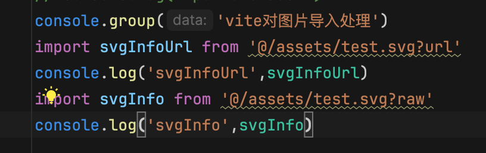
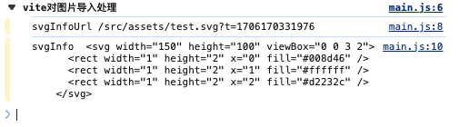
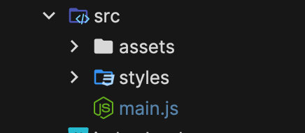
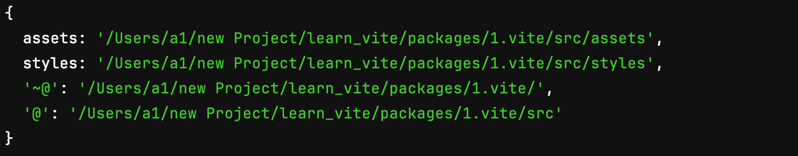

# Vite
## vite config css viteConfig 配置
### module css模块化配置
| 属性               | 描述 | 值                                                                                                                                                      |
|------------------| ------|------------------------------------------------------------------------------------------------------------------|
| localsConvention | 配置css模块化导出对象属性名称 (改变modules对象 key 值) | 'camelCase': 导出小驼峰格式且原来下划线格式还在<br/>'camelCaseOnly'：导出小驼峰格，原来格式没有<br/>'dashes'：以中划线分割单词<br/>'dashesOnly'：<br/>自定义的生成方法：返回字符串，返回的字符串就是对象的属性名字如 ``` (e)=>`lcc_${e}` ``` |
|scopeBehaviour|是否开启模块化|默认：local 开启，global: 关闭 |
|generateScopedName| css模块化对象属性值 类名生成规则 | ```string \| (name: string, filename: string, css: string)=>string ```<br/> name: 类名, filename: ，文件名称, css: css样式  <br/><br/> `[name]_[local]_[hash:5]` name 文件名 local 原来类名 hash hash值 :5 hash值前五个字母 <br/> [查看所有可选值](https://github.com/webpack/loader-utils#interpolatename) |
|hashPrefix|生成 hash前加上前缀|```string```|
|globalModulePaths| 想要忽略的路径 | ```string[]``` |

### preprocessorOptions css预处理器配置 如：sass less
- [详细 sass 配置](https://sass-lang.com/documentation/js-api/interfaces/options/)
### devSourcemap 是否开启css源码地图 值：```boolean```
### postcss 配置 css预处理器配置
#### plugins 插件配置
- postcss-preset-env 预设环境 可自动补全浏览器兼容性<br/><br/>
- @csstools/postcss-global-data postcss是按照文件读取顺序加载的 所以需要在postcss全局变量配置文件中添加全局变量文件 让全局变量文件优先加载 这样生成的css变量将会做适配处理
## vite resolve
- vite在处理图片时可以在图片导入路径后面加上params ?url | ?raw
<br/><br/>
 
<br/><br/>控制台打印结果<br/><br/>
 

| 属性 | 描述 | 值                                                                                                  |
|------|------|----------------------------------------------------------------------------------------------------|
| alias | 别名配置 | ```{[key:string]:string} ```<br/>例如：```{'@':fileURLToPath(new URL('./src',import.meta.url))} ``` |
## vite build 配置
```js
{
    rollupOptions:{
        output:{
            assetFileNames:"lcc_[name]_[hash].[ext]" // 打包静态资源名称
        }
    },
    assetsInlineLimit:409600, // 图片小于400kb时，转为base64
    outDir : "testDist", // 打包生成目录名W
    assetsDir : 'static', // 打包静态资源目录名
    sourcemap:true, // 打包生成sourcemap
    minify:true, // 打包生成压缩文件
    emptyOutDir:true, // 打包时清空输出目录
}
```

### 配置示例
```js

import {defineConfig, loadEnv} from "vite";
import { fileURLToPath, URL } from 'node:url'
import postcssPresetEnv from 'postcss-preset-env'
// /** @type import('vite').UserConfig **/
// const viteConfig = {
//     optimizeDeps:{
//         exclude:[]
//     }
// }
/** @type import('sass').Options **/
const sassOptions = {
    // alertAscii:false
}
export default defineConfig(({mode})=>{
    // console.log(fileURLToPath(new URL('./env',import.meta.url)))
    // const env = loadEnv(mode,fileURLToPath(new URL('./env',import.meta.url)),"")
    // console.log(env)
    return {
        envDir:'./env',
        css:{
            modules:{
                localsConvention:'camelCaseOnly', // css modules对象的key值
                scopeBehaviour:'local', // 是否开启模块化
                generateScopedName:`[name]_[local]_[hash:5]`, // css modules对象属性值 类名生成规则
                hashPrefix:'lcc', // 生成 hash前加上前缀
                // globalModulePaths:['./src/styles/global.module.css'] // 需要忽略的模块化css
            },
            preprocessorOptions:{
                sass:sassOptions // sass配置
            },
            devSourcemap:true, // 开发环境是否生成sourcemap
            postcss:{ // postcss配置 postcssPresetEnv 后处理
                plugins:[postcssPresetEnv()]
            }
        },
        resolve:{
            alias:{ // 路径别名
                '@':fileURLToPath(new URL('./src',import.meta.url)),
                '~':fileURLToPath(new URL('./',import.meta.url)),
            },
        },
        build:{
            rollupOptions:{
                output:{
                    assetFileNames:'lcc_[name]_[hash].[ext]' // 打包静态资源名称
                },
            },
            assetsInlineLimit:409600, // 图片小于400kb时，转为base64
        }
    }
})
```
- [Vite 详细配置](https://cn.vitejs.dev/config/)
- [Rollup 详细配置](https://www.rollupjs.com/configuration-options/)

## vite 插件
解释：在不同的生命周期调用不同的插件以打包不同的目的 
- 示例
```js
import {readdirSync,statSync} from 'node:fs'
import {resolve} from "node:path";

// 自动将src目录下的子文件夹配置成 alias 别名
const autoAliasesVitePlugin =  ()=>{
    return {
        name:'auto-aliases-vite-plugin',
        async config(config){
            const path = resolve(process.cwd(),'./src')
            const srcDir =  readdirSync(path);
            const aliases = {}
            for (let i = 0; i < srcDir.length; i++) {
                const dirPath = resolve(path,srcDir[i])
                const info = statSync(dirPath);
                if(srcDir[i],info.isDirectory()) aliases[srcDir[i]] = dirPath;
            }
            config.resolve.alias = {...aliases,...config.resolve.alias}
            return config
        }
    }
}
export default autoAliasesVitePlugin
```
<br/>目录结构 `src` 如下<br/><br/>

<br/><br/>生成的 `alias` 配置如下<br/><br/>
